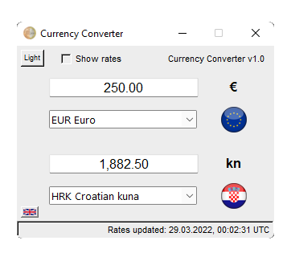

Program: Currency Converter

Author: Marko Zec

Version: 1.0

#

About:

Currency converting application written in python using tkinter GUI framework.
Supports currency autocompletion, english and croatian languages.

Exhange rates source: https://www.exchangerate-api.com/

[DOWNLOAD](https://github.com/marko-zec/Currency-Converter/releases/tag/v1.0)
